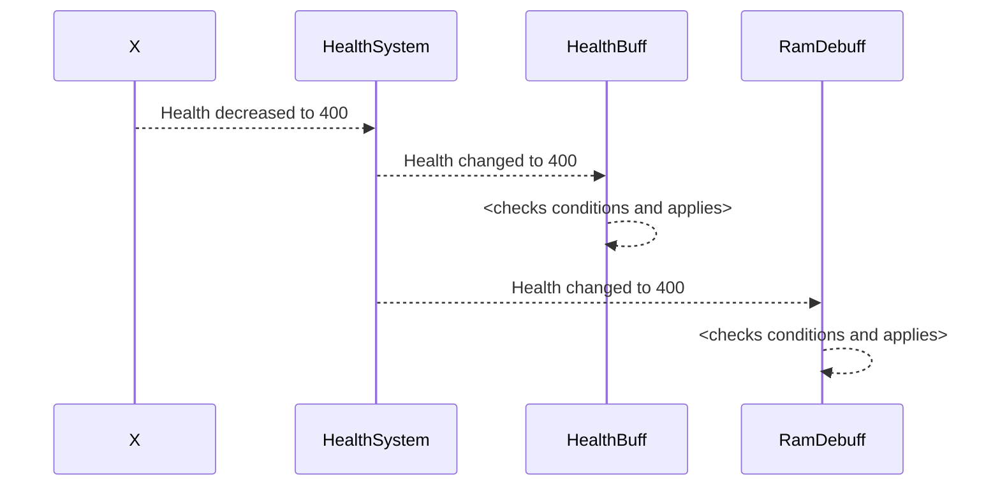
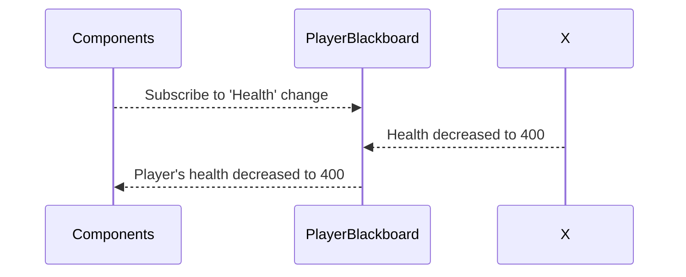

# Blackboards explained

Blackboards are basically the implementation of the [observer pattern](https://refactoring.guru/design-patterns/observer).

## Blackboard definitions

Blackboard definition is a class that allows to retrieve and set values of the blackboard.
Think of it as a class that contains references to other classes (which are blackboard values).

Too hard? Yeah. Don't think about it. Here's what you need to know:
1. All blackboard definitions can be retrieved in one global function call.
2. Blackboard definitions are immutable. You can't just add a new field to it.

Their class name usually ends in `Def` and they all inherit from base class [`BlackboardDefinition`](https://nativedb.red4ext.com/c/8663493686253995).

## Retrieving blackboard definitions

1. Call global function [`GetAllBlackboardDefs`](GetAllBlackboardDefs.md)
2. Retrieve the blackboard definition from [`AllBlackboardDefinitions`](https://nativedb.red4ext.com/c/1281419738661963)

## Why does it exist?

We have player's health, right? Let's imagine we have 2 in-game components that depend on player's health value:

1. Apply +20% defense buff if HP > 30% (aka `HealthBuff`)
2. Apply -10%/sec RAM regeneration debuff if your HP is full. (aka `RamDebuff`)

Last component (third one) actually contains health value and manages it. (aka `HealthSystem`)

How would this 3 components communicate with each other?

Each component would have either to:
1. Request current health from the HealthSystem every tick, or;
2. HealthSystem will notify dependents on each health change.

First option is really inefficient. Let's try second one? 

In this example `HealthSystem` manually notifies all systems that need to receive an update.

Now, what happens when we add another component that depends on player's health?

We should modify `HealthSystem` to modify our new component. What if we add 100 more dependents?
What if we have 500 more dependents and 100 more component that could change health at any time?

Congrats, we've just invented an [antipattern](https://en.wikipedia.org/wiki/Anti-pattern) because our HealthSystem class will grow with the amount of the components that depend on it.

## How does blackboards actually work?

Each component can subscribe and update the value of the blackboard. Once the value changes, blackboard notifies everyone who's subscribed to that exact value.

`Components` on this diagram represent a lot of different components at once.

What did we achieve with the observer pattern?
1. We don't need to modify an actual service that manages user's health when creating new component.
2. We can communicate values between scripts and native code easily.

## Where are blackboards actually used?

Well, at many different places. Mostly UI so it updates when something important happens.

Sometimes value in the blackboard is the actual value that is used everywhere. Sometimes - otherwise, it could be just a copy and nothing will happen in game logic (except UI for example) if you change it.

